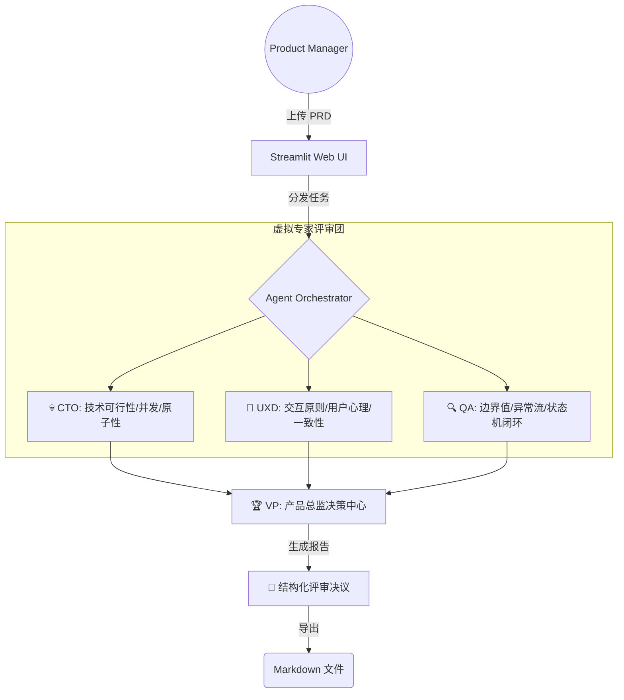

# 🛡️ AI PRD Guardian (PRD 逻辑卫士)

> **"在研发敲下第一行代码前，消灭 90% 的潜在逻辑漏洞。"**  
> 这是一个专为产品经理设计的 **Multi-Agent 协同评审工具**。它模拟由 **CTO、UX 专家、QA 经理** 组成的精英评审团，对需求文档进行深度“对抗性”审查，确保方案的严谨性与可行性。

---

## 🌟 核心痛点 (Problem Statement)

*   **技术盲点**：初级 PM 容易忽略“接口幂等性”、“原子性”、“脏写”等可能导致资损的技术风险。
*   **视角单一**：个人撰写 PRD 时难以覆盖极端情况（Edge Cases）和异常流。
*   **沟通损耗**：在评审会上被研发/测试反复质疑逻辑不闭环，导致项目反复拉扯。

## ✨ 核心特性 (Key Features)

*   **🤖 多智能体并行评审 (Multi-Agent Review)**：模拟 CTO、UXD、QA 三方视角，提供比通用大模型更具专业深度的评审意见。
*   **💡 闭环解决方案 (Actionable Advice)**：不仅指出问题，还提供 **[PM 侧]**（可直接复制进 PRD）和 **[技术侧]**（给研发的建议）的解决方案。
*   **📊 结构化决议报告 (Executive Summary)**：由“虚拟产品总监 (VP)”进行决策汇总，提供 0-100 评分、P0-P2 评级以及阻断性问题列表。
*   **📥 一键导出报告**：支持生成标准的 Markdown 评审报告，方便归档和分发。

---

## 🏗️ 系统架构 (Architecture)

本项目采用了 **Map-Reduce** 的任务处理思想：
1.  **Map (专业分工)**：并行分发 PRD 任务给具备不同人设权重的专家 Agent。
2.  **Reduce (共识汇总)**：通过汇总 Agent 过滤冗余信息，平衡各方冲突，输出最终管理决策。



---

## 🧠 提示工程 (Prompt Engineering)

本项目通过精心构造的 **Role-Specific Prompts**，强制 LLM 调用深层专业知识库：

*   **CTO Agent**：注入 **CAP/BASE 理论**、**Race Conditions** 识别指令，强制检查资损风险。
*   **UXD Agent**：基于 **Nielsen 10 Heuristics (尼尔森十大原则)**，关注认知负荷与容错设计。
*   **QA Agent**：采用 **Pessimistic Thinking (悲观思维)**，专注边界值分析与状态机陷阱。

---

## 🚀 快速开始 (Quick Start)

### 1. 克隆项目
```bash
git clone https://github.com/DD-HAHA/ai-prd-guardian.git
cd ai-prd-guardian
```

### 2. 安装依赖
```bash
pip install -r requirements.txt
```

### 3. 配置环境
在根目录下创建 `.env` 文件，填入您的 API Key (本项目兼容 OpenAI SDK 格式):
```env
DEEPSEEK_API_KEY=your_sk_key_here
```

### 4. 运行
```bash
streamlit run app.py
```

---

## 🛠️ 技术栈 (Tech Stack)

*   **Language**: Python 3.9+
*   **UI Framework**: Streamlit (SaaS 级交互视觉)
*   **LLM Engine**: DeepSeek-V3
*   **Orchestration**: 自研 Multi-Agent 并行调度逻辑

---

## 📈 路线图 (Roadmap)

- [ ] 支持上传 PDF/Word/Docx 格式 PRD
- [ ] 接入企业级知识库 (RAG)，基于公司特定技术规范进行评审
- [ ] 增加 API 接口文档自动生成功能
- [ ] 支持多语言评审报告输出

---

**Author**: DD-HAHA  
**License**: MIT  
**Project Link**: [https://github.com/DD-HAHA/ai-prd-guardian](https://github.com/DD-HAHA/ai-prd-guardian)

